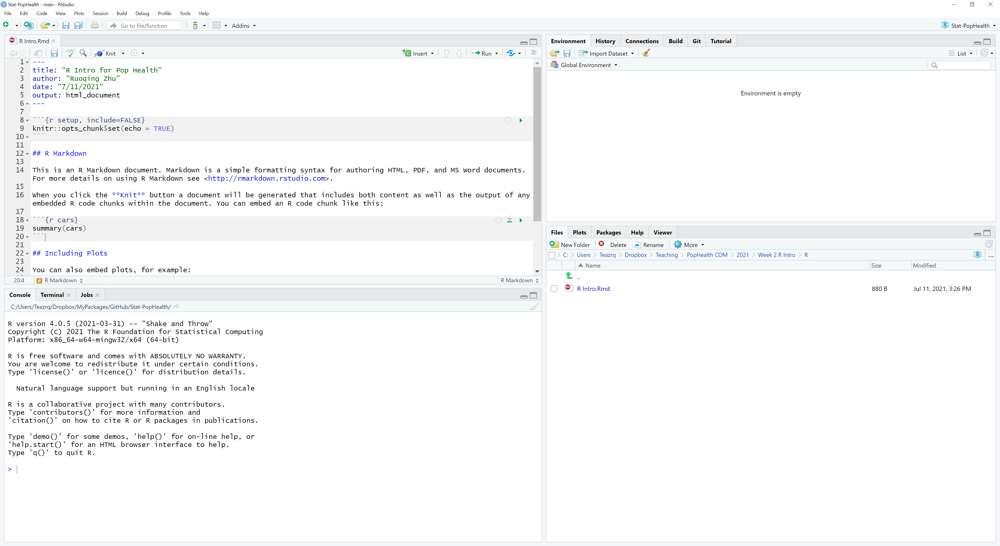
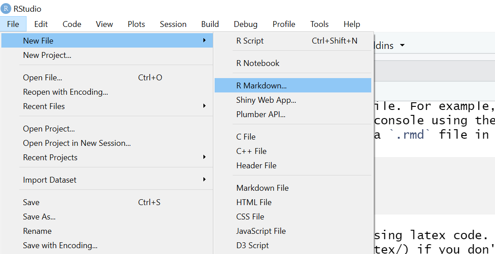
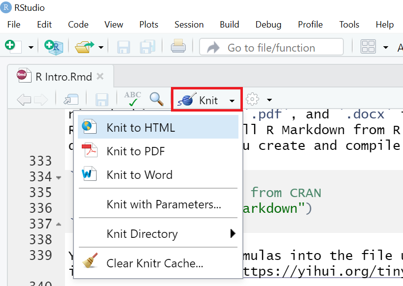

```{r set-options, echo=FALSE, cache=FALSE}
  options(width = 1000)
  knitr::opts_chunk$set(fig.width=9, fig.height=7, out.width = "75%", fig.align = 'center')
  knitr::opts_chunk$set(class.source = "fold-show")
  knitr::opts_chunk$set(collapse=TRUE)
```

## Installing R and RStudio

The first step is to download and install [R](https://www.r-project.org/) and [RStudio](https://www.rstudio.com/products/rstudio/download/#download). Most steps should be self-explanatory. You can also find many online guides for step-by-step instruction, such as [this YouTube video](https://www.youtube.com/watch?v=cX532N_XLIs&t=19s/). However, be aware that some details may have been changed over the years. 

After installing both, open your RStudio, you should see four panes, which can be seen below: 

  * Source pane on top-left where you write code in to files
  * Console on bottom-left where the code is inputted into R
  * Environment (and other tabs) on top-right where you can see current variables and objects you defined
  * File (and other tabs) on bottom-right which is essentially a file borrower

<center>
{width=75%}
</center>

We will mainly use the left two panes. You can either directly input code into the console to run for results, or edit your code in a file and run them in chunks or as a whole. 

## Basic Mathematical Operations

Basic R calculations and operations should be self-explanatory. Try to type-in the following commands into your R console and start to explore yourself. Lines with a `#` in the front are comments, which will not be executed. Lines with `##` in the front are outputs you should expect. 

```{r}
    # Basic mathematical operations
    1 + 3
    1 - 3
    1 * 3
    1 / 3
    3^5
    4^(-1/2)
    pi
    
    # some math functions
    sqrt(4)
    exp(1)
    log(3)
    log2(16)
    log(15, base = 3)
    factorial(5)
    sin(pi)
    
    # logic operators
    4 == 1
    !TRUE
    c(TRUE, TRUE) & c(TRUE, FALSE)
```

If you want to see more information about a particular function or operator in R, the easiest way is to get the reference document. Put a question mark in front of a function name:

```{r, eval=FALSE}
    # In a default R console window, this will open up a web browser.
    # In RStudio, this will be displayed at the ‘Help’ window at the bottom-right penal (Help tab). 
    ?log10
    ?cos
```

## Data Objects

Data objects can be a complicated topic for people who never used R before. The most common data objects are `vector`, `matrix`, `list`, and `data.frame`. They are defined using a specific syntax. To define a vector, we use `c` followed by `()`, where the elements within the parenthesis are separated using comma. You can save the vector and name as something else. For example

```{r}
    # creating a vector
    c(1,2,3,4)
    c("a", "b", "c")
    
    # define a new vector object, called `x`
    x = c(1,1,1,0,0,0)
```

After defining this object `x`, it should also appear on your top-right environment pane. To access elements in an object, we use the `[]` operator, like a `C` programming reference style.

```{r}
    # getting the second element in x
    x[2]

    # getting the second to the fourth element in x
    x[2:4]
```

Similarly, we can create and access elements in a matrix:

```{r}
    # create a matrix by providing all of its elements
    # the elements are filled to the matrix by column
    matrix(c(1,2,3,4), 2, 2)

    # create a matrix by column-bind vectors
    y = c(1,0,1,0,1,0)
    cbind(x, y)

    # access elements in a matrix
    # Note that in R, upper and lower cases are treated as two different objects
    X = matrix(c(1:16), 4, 4)
    X
    X[2, 3]
    X[1, ]
    
    # getting a sub-matrix of X
    X[1:2, 3:4]
```  

Mathematical operations on vectors and matrices are, by default, element-wise. For matrix multiplications, you should use `%*%`.

```{r}  
    # adding two vectors
    (x + y)^2

    # getting the length of a vector
    length(x)
    
    # matrix multiplication
    X %*% X
    
    # getting the dimension of a matrix
    dim(X)
    
    # A warning will be issued when R detects something wrong
    # Results may still be produced however
    y + c(1,2,3,4)
```

`list()` creates a list of objects (of any type). However, some operators cannot be directly applied to a list in a similar way as to vectors or matrices. Model fitting results in R are usually stored as a list. For example, the `lm()` function, which will be introduced later.

```{r}  
    # creating a list
    x = list(c(1,2), "hello", matrix(c(1,2,3,4), 2, 2))

    # accessing its elements using double brackets `[[]]` 
    x[[1]]
```

`data.frame()` creates a list of vectors of equal length, and display them as a matrix-like object, in which each vector is a column of the matrix. It is mainly used for storing data. This will be our most frequently used data object for analysis. For example, in the famous `iris` data, the first four columns are numerical variables, while the last column is a categorical variable with three levels: `setosa`, `versicolor`, and `virginica`:

```{r}  
    # The iris data is included with base R, so we can use them directly
    # This will create a copy of the data into your environment
    data(iris)

    # the head function peeks the first several rows of the dataset 
    head(iris, n = 3)
    
    # each column usually contains a column (variable) name 
    colnames(iris)
    
    # data frame can be called by each individual column, which will be a vector
    # iris$Species
    iris$Species[2:4]
    
    # the summary function can be used to view summary statistics of all variables
    summary(iris)
```

## Readin and Save Data 

Data can be imported from a variety of sources. More commonly, a dataset can be stored in `.txt` and `.csv` files. Such data reading methods require specific structures in the source file: the first row should contain column names, and there should be equal number of elements in each row. Hence you should always check your file before reading them in. 

```{r}
    # read-in data
    birthrate = read.csv("birthrate.csv")
    head(birthrate)
    
    # to see how many observations (rows) and variables (columns) in a dataset
    dim(birthrate)
```

R data can also be saved into other formats. The more efficient way, assuming that you are going to load these file back to R in the future, is to save them as `.RData` file. Usually, for a larger dataset, this reduces the time spend on reading the data. 

```{r, eval = FALSE}
    # saving a object to .RData file
    save(birthrate, file = "mydata.RData")

    # you can specify multiple objects to be saved into the same file
    save(birthrate, iris, file = "mydata.RData")
    
    # load the data again back to your environment
    load("mydata.RData")
    
    # alternatively, you can also save data to a .csv file
    write.csv(birthrate, file = "mydata.csv")
    
    # you can notice that this .csv file contains an extra column of "ID number", without a column name
    # Hence, when you read this file back into R, you should specify `row.names = 1` to indicate that.
    # Otherwise this will produce an error
    read.csv(file = "mydata.csv", row.names = 1)
```

## Distribution and Random Numbers

Three distributions that are most frequently used in this course are Bernoulli, Gaussian (normal), and $t$ distributions. Bernoulli distributions can be used to describe binary variables, while Gaussian distribution is often used to describe continuous ones. The following code generates some random variables

```{r echo=FALSE}
  set.seed(2) # this will not show
```

```{r}
  # read the documentation of rbinom() using ?rbinom
  x = rbinom(100, 1, 0.4)
  table(x)
```

However, this result cannot be replicated by others, since the next time we run this code, the random numbers will be different. Hence it is important to set and keep the random seed when a random algorithm is involved. The following code will always generate the same result

```{r out.width='50%'}
  set.seed(1)
  x = rbinom(100, 1, 0.4)
  y = rnorm(100) # by default, this is mean 0 and variance 1
  
  table(x)
  hist(y, breaks = 20)
  boxplot(y ~ x)
```

## Statistical Functions

We will use some basic statistical functions in this course, for example, standard deviation, variance, correlation, etc.. Here are some examples:

```{r}
  # standard deviation
  sd(iris$Petal.Length)

  # variance 
  var(iris$Petal.Width)
  
  # correlation (this will be introduced later)
  cor(iris$Petal.Length, iris$Petal.Width)
```


## Using Packages and Other Resources

Packages are written and contributed to R by individuals. They provide additional features (functions or data) that serve particular needs. For example, the `ggplot2` package is developed by the RStudio team that provides nice features to plot data. We will have more examples of this later on, but first, let's install and load the package so that we can use these features. More details will be provided in the data visualization section. 

```{r, eval = FALSE}
  # to install a package
  install.packages("ggplot2")
```

```{r out.width='50%'}
  # to load the package
  library(ggplot2)

  # use the ggplot() function to produce a plot
  # Sepal.Length is the horizontal axis
  # Sepal.Width is the vertical axis
  # Species labels are used as color
  ggplot(iris, aes(Sepal.Length, Sepal.Width, colour = Species)) + 
    geom_point()  
```

You may also noticed that in our previous examples, all tables only displayed the first several rows. One may be interested in looking at the entire dataset, however, it would take too much space to display the whole table. Here is a package that would allow you to display it in a compact window. It also provides searching and sorting tools. You can integrate this into your report. 

```{r}
  library(DT)
  datatable(iris, filter = "top", rownames = FALSE,
            options = list(pageLength = 5))
```

Often times, you may want to perform a new task and you don't know what function can be used to achieve that. Google Search or Stack Overflow are probably your best friends. I used to encounter this problem: I have a list of objects, and each of them is a vector. I then need to extract the first element of all these vectors. However, doing this using a for-loop can be slow, and I am also interested in a cleaner code. So I found [this post](https://stackoverflow.com/questions/44176908/r-list-get-first-item-of-each-element), which provided a simple answer:

```{r}
  # create the list
  a = list(c(1,1,1), c(2,2,2), c(3,3,3))
  
  # extract the first element in each vector of the list
  sapply(a, "[[", 1)
```

Many machine learning models are implemented through contributed packages. For example, this following code uses a CART (classification and regression tree) model to predict the class of iris data:

```{r}
  # this package fits a tree model
  library(rpart)
  cart.fit <- rpart(Species ~., data = iris)
  
  # this package produces a nice plot
  library(rpart.plot)
  rpart.plot(cart.fit)
```

Whenever you need to use a new package, you can always find exmples by searching related key words online. 

## RMarkdown: organized your work

RMarkdown is a built-in feature of RStudio. It is <span style="color: red;">**not required**</span> in this course. You can complete the entire course material without using it. However, it offers many nice features. It integrates plain text with chunks of R code in to a single file, which is extremely useful when constructing class notes or building a website. A `.rmd` file can be compiled into nice-looking `.html`, `.pdf`, and `.docx` file. For example, this entire guide is created using R Markdown. With RStudio, you can install RMarkdown from R console using the following code. Note that this should be automatically done the first time you create and compile a `.rmd` file in RStudio.

```{r eval = FALSE}
  # Install R Markdown from CRAN
  install.packages("rmarkdown")
```

You can also write formulas into the file using latex code. For example, $Y = X \beta + \epsilon$. This requires installing [TinyTex](https://yihui.org/tinytex/) if you don't have some version of LaTex already:

```{r eval = FALSE}
  # Install TinyTex
  install.packages("tinytex")
```

Again there are many online guides for R Markdown, and these may not be the best ones. 

* [R Markdown Cheat Sheet](https://www.rstudio.com/wp-content/uploads/2015/02/rmarkdown-cheatsheet.pdf)
* [R Markdown Play-list (video)](https://www.youtube.com/playlist?list=PLBgxzZMu3GpNgd07DwmS-2odHtMO6MWGH)

To get started, create an R Markdown template file by clicking `File` -> `New File` -> `R Markdown...`

<center>
{width=60%}
</center>

You can then `Knit` the template file and start to explore its features.

<center>
{width=60%}
</center>

